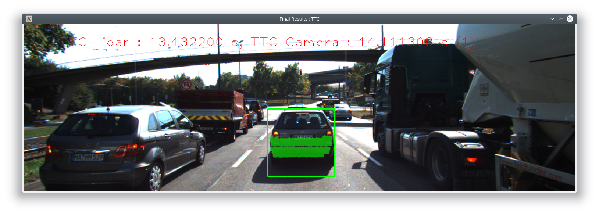
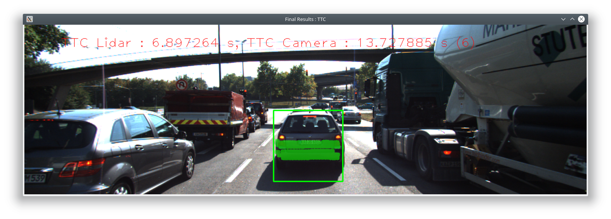
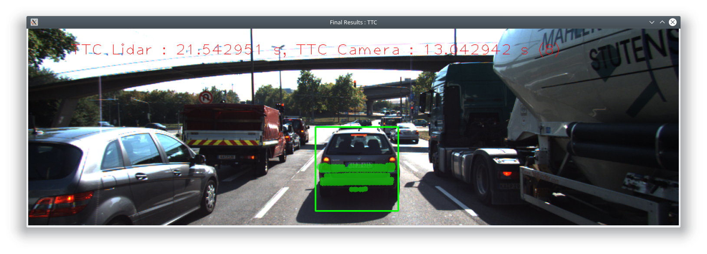
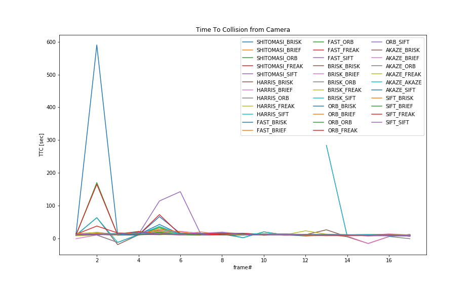
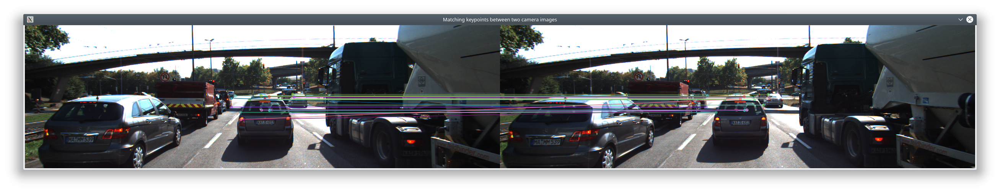
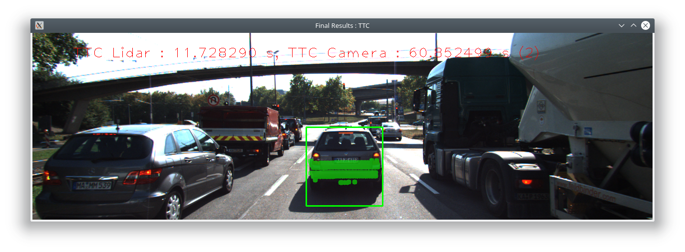
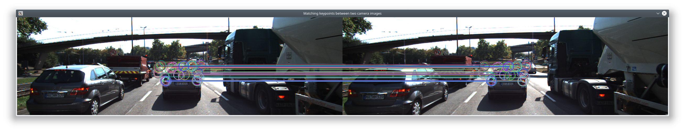
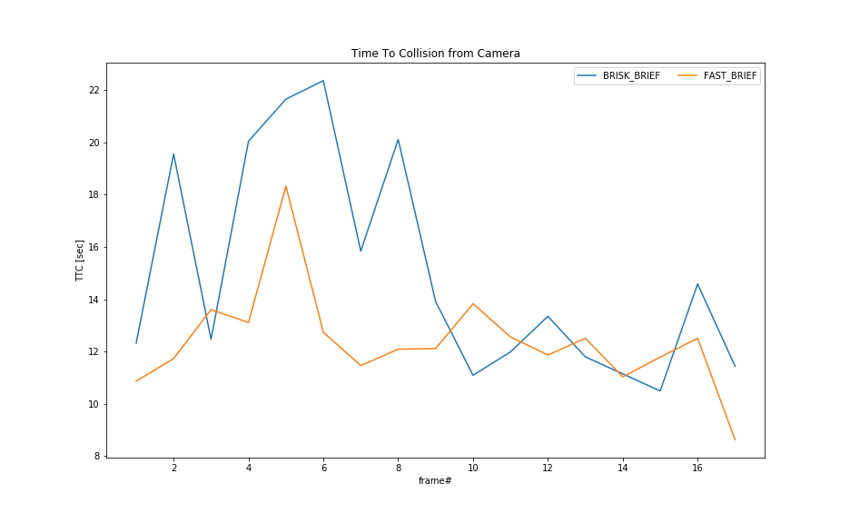

# ** 3D Feature Tracking Project**

## FP1: Match 3D Object

As proposed in the course I used a multimap here. The map contains an entry for each keypoint match storing thw two bounding boxes it is in for the current and the previous frame.
In the next step I iterate through all bounding boxes of the current frame and evaluate which bounding box of the previous frame is most often associated with it.
I was assuming the task fulfilled at that point but looking into the generated result I spotted suprising entries

| Curr Frame BBox | Prev Frame BBox |
| --------------- | --------------- |
|               0 |               0 |
|               1 |               1 |
|               2 |               2 |
|               3 |               3 |
|               4 |               0 |

So while Curr Frame BBox 0 is linked to Prev Frame BBox 0 it seemed that Prev Frame BBox 0 seemed to be associated to another Curr Frame BBox (4).
As this apparently didn't make a lot of sense I introduced another loop iterating over all Prev Frame BBoxes keeping for each of them only the one which has most keypoint matches. This modification apparently does the job. While the solution was easy it took some time to really understand the problem.

## FP2: Compute Lidar-based TTC

Staight forward implementation using the equation introduced in the course.
I added a filtering which is ignoring the 5% of the detections which is closest to get rid of outliers.

## FP3: Associate Keypoint Correspondance with Bounding Boxes

Here I have chosen an approach with 3 steps.
1. Identification of the keypoints which fall into the bounding box
2. Calculation of the mean distance value of all keypoints from (1).
3. All keypoint pairs with distance less than the mean are put into the result

## FP4: Compute Camera-based TTC

I simply adopted my code from the exercise before which works fine.
Due to an error introduced in step FP3 I learned that even the code given in the example solution for this one is not really robust.
In case step FP3 returns 0 matches the routine FP4 crashes as the outermost loop is executed nevertheless.
As I am not that perfect with iterators in c++ yet and wanted to make sure to not break the code I added an additional if conditions which is clearly not the most elegant way to fix this.

## FP5: Performance Evaluation 1

Find examples where the TTC estimate of the Lidar sensor does not seem plausible. Describe your observations and provide a sound argumentation why you think this happened.

|  Frame# |               Image                                |              Description                                        |
| ------- | -------------------------------------------------- | --------------------------------------------------------------- |
|    3    |                  | Outliers on the left lead to incorrect result - needs filtering |
|    6    |                  | Ghost detectionss, probably filtering away only the 5% closest was not enough      |
|    8    |                  | Obvious outliers on the left again, bounding box is not perfectly positioned       |

## FP6: Performance Evaluation 2
This last exercise is about running the different detector / descriptor combinations and looking at the differences in TTC estimation. Find out which methods perform best and also include several examples where camera-based TTC estimation is way off. As with Lidar, describe your observations again and also look into potential reasons.

The full list of detector/descriptor combinations with the calculated time to collision for each frame is available [here](report/table.md).

The graphical visualisation of the calculated TTC from camera show a mixed pictures. While some combination of detector / descriptor achieve reasonable results some others are completely off. 

Looking at the combinations that are massively off the combination using Harris detector are apparently among the critical ones.
### Detailed look at the Harris Detector failures

The first example shows a combination of Harris Detector with BRISK descriptors leading to a far of TTC at frame #2.

Looking deeper into the generated matches from the camera keypoints show that there are not really a lot of matches and quite a few of them are simply wrong.
Most prominent missmatches are on the rearlight which is matched to something completely different the next frame.
It is unclear if the matches coming from the car even further ahead are put into the evaluation as I used the static rectangle to cut out the matched keypoints for visualization.
 

Apparently Harris is not detecting a lot of corners and a too high percentage of those are mis-matched.

### Detailed look at the ORB Detectore in combination with BRISK.

Looking at the combination ORB / BRISK the calculate TTC from camera is also far off suprisingly also in frame #2 which for a human does not look that special.

Looking at the matches on the car there are really a lot of them and things look quite ok. However looking into the details quite a few of them are simply miss-matched leading to a significantly wrong distance results. An easy to spot example are the matches on the rear windscreen, the matches point to different positions in the other frame. It seems the BRISK descriptor is not really ideal for this type of pictures.
 

### Detailed look into the recommended combinations from the intermediate 2D project

In the intermediate project I decided to go with the combination Fast / Brief as it was so much faster than the combination Brisk / Brief which yielded much more matches. As final step I decided to analyze if there is an obvious systematic difference between the two option.

The diagram below illustrates the calculated TTC for those two combinations.

 

Comparing the two there is no clear advantage of Brisk/Brief visible which would justify the much higher computation time for this. Looking at the TTC computed from LIDAR and the pictures myself I would rather say that the FAST/BRIEF combination achieves more accurate results.
However without ground thruth data a quantitive assessment is impossible.
